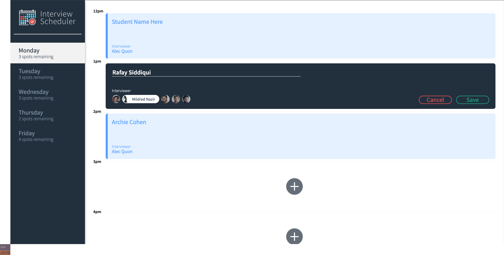

# Interview Scheduler

Interview Scheduler is a single-page React application that uses persistent data through an API server. Interview Scheduler manages appointment bookings with a list of interviewers who have different day-to-day availabilities.

## Final Product



## Dependencies

#### React
#### Webpack, Axios, Babel
#### Testing: Storybook, Webpack Dev Server, Jest, Testing Library

## Setup

#### Install dependencies with `npm install`.
#### Get database api at https://github.com/lighthouse-labs/scheduler-api
#### Run & Open Webpack Development Server at desired port (:8080 by default).

## Key Scripts

### Running Webpack Development Server

```sh
npm start
```

### Running Jest Test Framework

```sh
npm test
```

### Running Storybook Visual Testbed

```sh
npm run storybook
```
